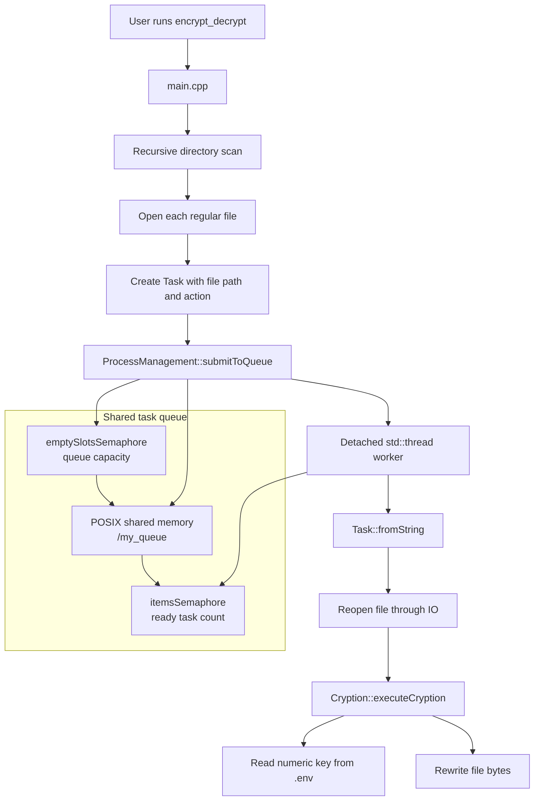

# Multithreaded File Encryption and Decryption Tool

Encrypty is a Linux command-line file encryption and decryption tool written in C++. This version focuses on concurrent file processing: every regular file found under the selected directory is submitted as a task and processed by a worker thread.

> This project is an operating-systems and concurrency exercise. Its reversible byte-shift algorithm is intended for learning and experimentation, not for protecting production secrets. Use test data because files are modified in place.

## What This Version Demonstrates

- Recursive directory traversal with C++17 `std::filesystem`
- Task submission and concurrent file processing with `std::thread`
- A bounded producer-consumer queue stored in POSIX shared memory
- POSIX semaphores for tracking available tasks and queue capacity
- Reversible encryption and decryption controlled by a numeric key in `.env`
- A Makefile build workflow and a Python test-data generator

## Architecture



### Processing flow

1. `main.cpp` asks for a directory and an action: `encrypt` or `decrypt`.
2. Each regular file in the directory tree becomes a `Task`.
3. `ProcessManagement` serializes the task into the shared queue.
4. A worker thread waits for an available task, removes it, and reconstructs the file stream.
5. `executeCryption` shifts each byte using the key from `.env`.
6. Encryption adds the key; decryption subtracts it, so the original bytes can be restored.

## Project Layout

```text
encrypty_multithreading/
├── main.cpp                         # CLI and recursive directory scan
├── Makefile                         # C++17 build targets
├── makeDirs.py                      # Generates test/test1.txt ... test100.txt
├── .env                             # Numeric byte-shift key
└── src/app/
	├── encryptDecrypt/              # Encryption and decryption logic
	├── fileHandling/                # File and environment-key handling
	└── processes/                   # Tasks, shared queue, semaphores, workers
```

## Requirements

- Linux, macOS, or Windows through WSL
- C++ compiler with C++17 support
- GNU Make
- Python 3

The program uses POSIX shared memory and semaphores, so native Windows builds are not supported by the current implementation. Use WSL on Windows.

## Build and Run

Run these commands from the repository root:

```bash
cd encrypty_multithreading

python3 -m venv .venv
source .venv/bin/activate

python3 makeDirs.py

make clean
make

./encrypt_decrypt
```

When the program prompts for input, enter:

```text
Directory path: test
Action: encrypt
```

The application processes every regular file inside `test/` recursively. To restore the generated files, run the executable again and enter:

```text
Directory path: test
Action: decrypt
```

The action must be lowercase: `encrypt` or `decrypt`.

## Test Data Generator

`makeDirs.py` creates a `test/` directory containing 100 text files. Each file contains a random 1,000-character string made from uppercase letters and digits. It does not perform encryption itself.

```bash
python3 makeDirs.py
```

The virtual environment is optional because the script uses only Python's standard library. It is included in the setup sequence to keep the project environment isolated.

## Key Configuration

The numeric value in `.env` is loaded at runtime and used as the byte-shift key:

```text
8717
```

Keep the same key when decrypting files that were encrypted with it. Because `.env` is read from the current working directory, run `./encrypt_decrypt` from `encrypty_multithreading`.

## Clean Build

```bash
make clean
make
```

`make clean` removes object files and both executables. A normal `make` rebuilds only files whose source timestamps have changed.
